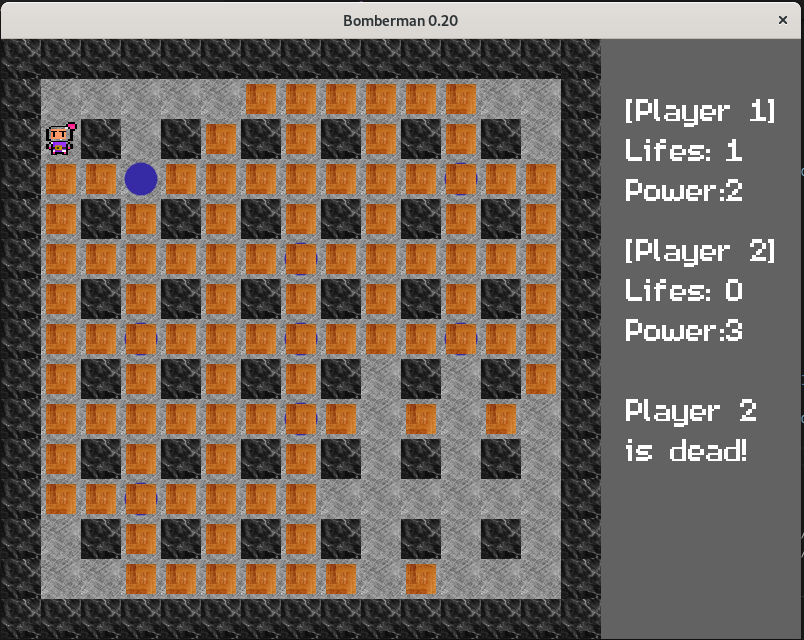

Bomberman V0.20
--------------------

Screen:
-------

-------

PRESS SPACE to drop bomb !

Dev Info :
---------

- We have now tile generation map, for now the map is an (15 x 15) tile for 40 pixels each. 
- We have COLLISIONS !
- Now moving case per case !
- Explosion animation.
- Function optimisation.
- Sound implementation, music playing constantly + bomb sound effect, the classical boom ! -> cutted for now
- The character is now big enough, good size !
- Menu added.
- Added server and client support.

///////// (old)

- Version 0.20 alpha. // New

Environment:
------------

- Install Debian 10 Buster

- Install VsCode like this :

	- sudo apt install gnupg2 software-properties-common apt-transport-https curl
	- curl -sSL https://packages.microsoft.com/keys/microsoft.asc | sudo apt-key add -
	- sudo add-apt-repository "deb [arch=amd64] https://packages.microsoft.com/repos/vscode stable main"
	- sudo apt update
	- sudo apt install code
	

- Install généraly needed tools/libs for devs (easy way), specially build essentials for gcc compilator and the make/cmake tools (automake yes I know) + other libs :

	- sudo apt install build-essential git make autoconf automake libtool pkg-config cmake ninja-build gnome-desktop-testing libasound2-dev libpulse-dev/
	  libaudio-dev libjack-dev libsndio-dev libsamplerate0-dev libx11-dev libxext-dev libxrandr-dev libxcursor-dev libxfixes-dev libxi-dev libxss-dev/
	  libwayland-dev libxkbcommon-dev libdrm-dev libgbm-dev libgl1-mesa-dev libgles2-mesa-dev libegl1-mesa-dev libdbus-1-dev libibus-1.0-dev libudev-dev fcitx-libs-dev 
	

- Install SDL2 with following commands :

	- sudo apt install libsdl2-dev
	- sudo apt install libsdl2-image-dev
	- sudo apt install libsdl2-ttf-dev
	- sudo apt install libsdl2-mixer-dev
	

- Also install gdb a debugger for VS :

	- sudo apt install gdb
	

Folder Structure:
-----------------

_______________________
- folder include
|
- folder lib
|
- folder output
|
- folder src
|
- file Makefile
|
- file .gitignore
|
- file README.md
_______________________

